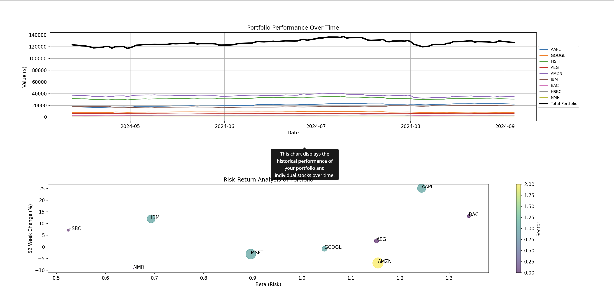
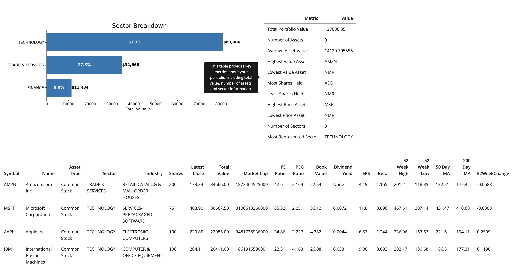
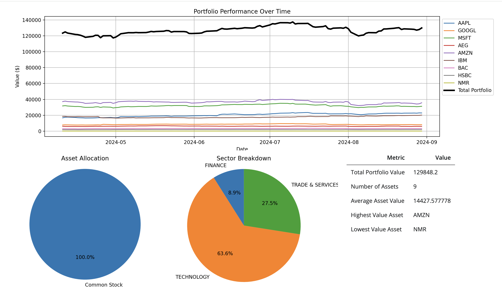

# Portfolio Dashboard

This project is a dashboard for tracking and analyzing stock portfolios.

## Features

- Fetch stock data from Alpha Vantage API (Free API Key is sufficient for this project)
- Cache API responses in SQLite database
- Display portfolio information

## Demo

### Portfolio Dashboard



*An example dashboard displaying a portfolio of stocks.*

### Input Overview

*Input options and a summary table of the portfolio.*

## Setup

1. Clone the repository

```bash
git clone https://github.com/roman91DE/portfolio_dashboard.git
```

2. Install dependencies

```bash
pip install -r requirements.txt
```

3. Set up your Alpha Vantage API key
```bash
export ALPHA_VANTAGE_API_KEY='your_api_key_here'
```
Or set the key in a .env file

4. Run the application with:

```bash
python3 run.py [-h] [-d] [-p PORT]
```

### Command Line Options

| Option | Description |
|--------|-------------|
| `-h, --help` | Show help message and exit |
| `-d, --debug` | Run in debug mode |
| `-p PORT, --port PORT` | Specify the port to run the app on (default: 8000) |


5. Open your browser and navigate to `http://localhost:8000` (or the port you specified)

## Usage

You can input your portfolio either in CSV format or manually by specifying the symbol and number of shares you own. The output will show a timeseries of the value of your portfolio, a breakdown by sector and asset class, and some key metrics.

## Limitations

If you input your portfolio in CSV format, the symbol must be a valid ticker symbol, and the number of shares must be a positive integer.

When using the free Alpha Vantage API, the maximum number of requests per day is 15 per day, the app uses a daily cache to reduce the number of requests.


## Contributing

Contributions are welcome! Please feel free to submit a Pull Request.

## License

This project is licensed under the MIT License. For more details, see the LICENSE file.