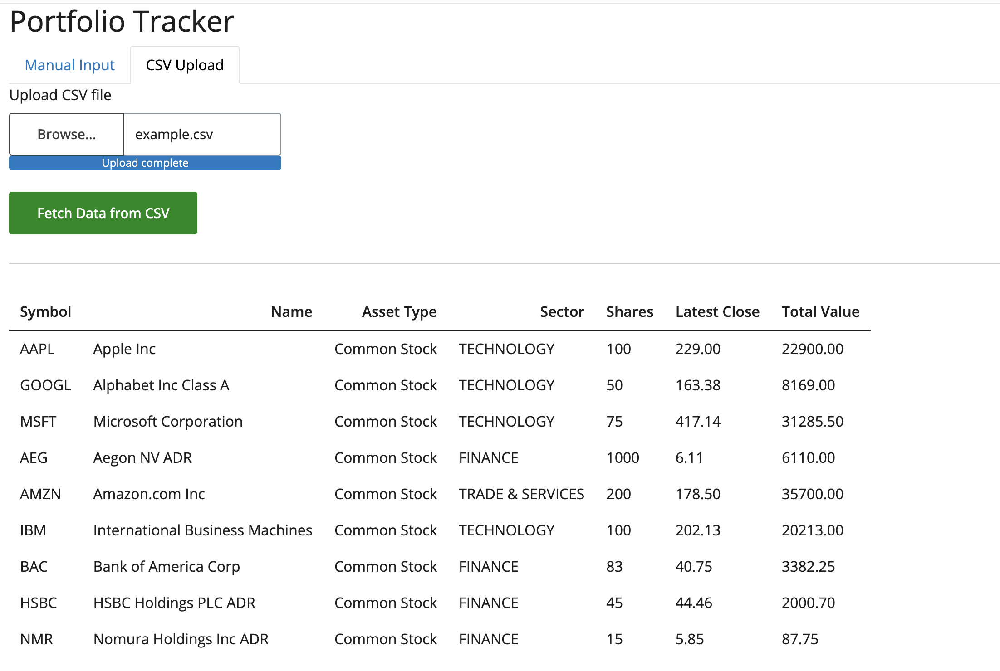

# Portfolio Dashboard

This project is a dashboard for tracking and analyzing stock portfolios.

## Features

- Fetch stock data from Alpha Vantage API (Free API Key is sufficient for this project)
- Cache API responses in SQLite database
- Display portfolio information

## Demo

An example dashboard displaying a portfolio of stocks.

Input options and a resume table of the portfolio.

## Setup

1. Clone the repository
2. Install dependencies
3. Set up your Alpha Vantage API key
4. Run the application with `python run.py [-d]`
5. Open your browser and navigate to `http://localhost:5173`

## Usage

You can input your portfolio either in CSV format or manually by specifying the symbol and number of shares you own. The output will show a timeseries of the value of your portfolio, a breakdown by sector and asset class, and some key metrics.

## Limitations

If you input your portfolio in CSV format, the symbol must be a valid ticker symbol, and the number of shares must be a positive integer.

When using the free Alpha Vantage API, the maximum number of requests per day is 15 per day, the app uses a daily cache to reduce the number of requests.

## Contributing

Contributions are welcome! Please feel free to submit a Pull Request.

## License

This project is licensed under the MIT License. For more details, see the LICENSE file.